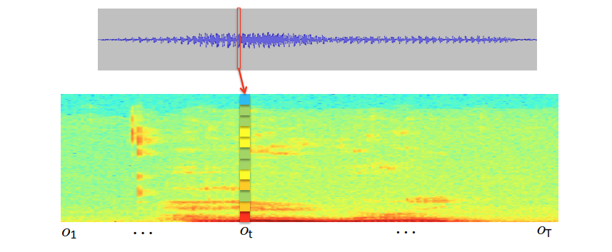

# What is conversational AI and what is conversation analysis?

This blog aims to get two groups of people talking to each other more. The people that work in the field of conversational AI and speech processing - all the engineers and computer scientist that have an interest to enable humans to interact more naturally and extensively with technology using speech. And those that work in converasation analysis, the scientific study of talk. Based on their shared interest, the scientists and engineers of talk surely have a lot to talk about. It just seems that both communities are not as connected as one might think. Both fields have their own scientific conferences and publication venues, and both professions require a different skill set, one arguably more technical and the other more theoretical. This blog hopefully contributes to sparking the interest of the speech technologist and the conversation analyst in each other's work.

## The quest for more natural dialogs between humans and technology 

Conversational AI is the field that works to bring about new ways of how humans and technology interact using speech. Or, commerically speaking, the field that enables and enhances user experiences of voice-enabled products. Part of this is to create experiences that make the user feel as if s/he is talking to a human. Voice-enabled technology becomes part of our life when we are woken up by a virtual assistant in the morning, when we are asking our car for directions on our commute and when we contact customer service chatbots while shopping. Ideally, we speak in our normal voices and the devices understand and replies naturally and effortlessly. The ability to simulate human behaviour is an important part of such products. The inner workings of this type of interactive, voice-enabled technology are complex, usually involving multi-step processes and requiring considerably computing power. Typically, the different processing stages involved are grouped into three parts: 

    1. Automatic Speech Recognitions (ASR)
    2. Natural Language Processing (NLP) or Natural Language Understanding (NLU)
    3. Text-to-Speech (TTS) with voice synthesis
 
 The first stage is speech recognition, the conversion of human speech input into subtitle-like transcriptions. The second is natural language processing and understanding - the stage at which a variety of modules further processes the ASR transcription, usually by interacting with databases or web services. For instance, translating the input into another language or performing a web search. The last stage, TTS, is the technology in charge of producing synthesized voice-output back the user.
 
<figure>
  <figcaption>Figure 1: A typical conversational AI pipeline as a three-stage process. (Credit: developer.nvidia.com/conversational-ai)</figcaption>
  
</figure>

This typical conceptualization of a conversational AI pipeline suggest that the pipeline consists of three parts. A recognition part where speech is translated into text. A processing part where a certain task is fulfilled, such as machine translation, seq-to-seq question answering or query search. And a voice production part that communciates the output of the process back to the user.

%%UNDER CONSTRUCTION
CA critique
this ist he first part whenre the CA person would say

transcription is research
word level transcription is a reduction of utterances to some information. instead of transduction or translation

a lot is lost in the process and the subtitle-like transcript is certainly not an ideal basis to find out WHY THIS NOW.
This is why CA has developed another format of transcribing talk that is better at capturing how human speak in natural talk.
 (Bolden 2015)
 
 conclusion certainly better representations are needed to do more things with speech input. But before getting there , a closr look at the current state of ASR.

#### Automatic speech recognition: state of the art

Automatic speech recognition (ASR) technology comsumes human voice inout and outputs readable text, usually in the form of subtitle-like tanscriptions of talk. ASR is a key step in conversational AI pipelines because any further processing down the line is conducted on the basis of this output. The ability of ASR modules to produce these subtitles has siginificantly increased in recent years as deep learning has replaced other statistical methods such as Hidden Markov Models or Gaussian Mixture Models. Popular current ASR modules include Deepspeech, Wav2letter, Listen-Attend-Spell and Jasper. They all fall into the category of end-to-end ASR systems and typically work something like this: 

 
<figure>
  <figcaption>Figure 2: A typical ASR pipeline design. (Credit: developer.nvidia.com/conversational-ai)</figcaption>
  
</figure>

The first step is to record sound with some kind of capturing device, usually a microphone array that provides proprocessing capabilties such as noise suppression, echo cancellation, automatic gain control etc. These proprocessing step aim to better separate human voice input from noise and other unwanted input. Second, Mel Frequency Cepstral Coefficient (MFCC) techniques are used to capture audio spectral features in a spectrogram. By "printing" sound as spectrograms, ASR from here on essentially becomes an image recognition task. The question becomes how accurately can our system recognise characters and words in the spectrograms? Humans can actually also learn to <a href="http://home.cc.umanitoba.ca/~robh/howto.html">read spectrograms</a>. ASR modules attempt this by passing the spectrograms to a deep learning-based acoustic model that predicts the probability of characters over a stretch of spectrogram input. This is a matching task that takes the spectrogram as input and chops it up into a series of time steps. And it takes a small set of characters from an alphabet-like list as input. For English, this might be a list from A-Z, or Pinyin syllables for Chinese. The model then predicts the character for each time step of the spectrogram. It can do that because it has been trained on large datasets (e.g. Librispeech, WSJ ASR corpus or the Google Audio set) that consist of hours of audio with aligned transcripts. The output is a series of characters aligned to the time steps of the spectogram input. 

 
<figure>
  <figcaption>Figure 3: Step-wise estimation of characters from spectrogram. (Credit: cs.stanford.edu/~acoates/ba_dls_speech2016.pdf)</figcaption>
  
</figure>

The character-by-character output of the acoustic model might look like this:

       H H E E E L L L O O O O O O
or: 

       Y Y H H E E L L O O O O 

Next, a decoder with a language model estimates what word matches these character series. With the help of a language model (a large corpus of the target language), the decoder computes "Hello" and "Yellow" from series of single characters like those above based on coocurrence patterns. Depending on the product, the words can then be further buffered into phrases or neat sentences with added punctuation before getting sent to additional natural language processing or natural language understanding modules. To save time and computing power, decoders often rely on pretrained models such as BERT.

#### Character sets and language models as limitations

chracter sets and non-lexical utterances
oov 
zipf distributions and 
proper noun problem

#### The Tchaikovsky problem

%% UNDER CONSTRUCTION

## Getting computers to do conversation analysis

%% UNDER CONSTRUCTION

conversation analysis is both the scientific study of talk. Done by a professional who is arguably better at this than the average person. But conversation analysis also refers to the on-line analysis of the talk of our interloctutors as part of human conversation. We are all lay conversation analyst in this sense. This is also sometimes referred to as "mind reading" - the abilities and the awareness of human conversationalists to accurately infer what their interlocutors are doing during talk, where they are as part of the unfolding of sequences of talk and to more or less accurately guess how their interlocutors feel.

specialist ASR for specialist NLU modules such as sentiment, emotion and stance detection, phonetic asr (microsoft speech-to-phone link)

## Principles of speech technology and system design

The development of speech technology is guided by the following principles (Gillis et al. 2009):

<i>problem reduction</i>: a task is decomposed into a number of simpler substasks which can be further decomposed until subtasks are distinguished which can directly be modeled and implemented.

<i>modularity</i>: the program achieving a task is divided into different modules, often corresponding to major substasks, which are more or less autonomous, specialized information processors.

<i>formalization</i>: Within each module, a formalism is designed that puts together the necessary knowledge and methods needed for that module to accomplish its task. The respective formalism needs to capture the representation and manipulation of the specific slice of knowledge, i.e. it provides a bridge between theory and implementation. Such formalizations provide the means with which the necessary knowledge is organized in a certain way. However, this necessary step of (re)organizing the data is often problematic for a number of theoretical reasons (see section "On reductionism").
Formalization ultimately provides a means to enable inference for how the data can be used to solve the task at hand, either through 'procedual formal models' that enable direct inference based on specific instances or through 'declarative formal models' that exhibit a larger degree of separation between knowledge representation and inference aspects of a problem. Formalisms represent linguistic knowledge in various forms. In the area of grammar and linguistic structure the often take the form of state-space search models, logic-based or rule-based formalizations. In semantics the may come in form of graph-based representations such as semantic networks and frames (see section "framenets and constructicons").

As for dialog systems, the task of interpreting and generating natual language is usually decomposed into various subtasks tied to 'linguistic units', i.e. phoneme, word, turn (or sentence) and discourse. Based on this division, a larger architecture of various modules is established both on the language understanding and the language generation side. Possible modules in language understanding are: <i>speech recognition, morphological analysis, syntactic parsing, semantic analysis </i> and <i>discourse analysis</i>. And for language generation: <i>discourse planning, turn (or sentence) generation, morphological generation</i> and <i>speech production</i>.

The modules are often organized as part of a sequential architecture where the different modules are accessed in sequence and the output of one module is directly input into the next module. Recently, more interactive architectures have also gained popularity where the modules are not strictly accessed in a sequential fashion, but feature more links and feedback loops between different modules (i.e. distributed connectionist models). This is especially true for the syntax-semantics interface where a trend can be observed away from 'syntax first' strategies in which a syntactic parse is computed first and then fed into a semantic module. Instead, new approaches to the syntax-semantics interface enable an integration of these formely separate  modules, often drawing on cognitive grammars (see section "Framenets and Constructicons"). Noteably, this trend is a reminder that the division into modules is fact driven by design decisions based on the principles of 'problem reduction' and 'modularity', but that it is by no means garanteed that the dividing lines in such a system accurately reflect talk-in-interaction in humans. This also applies to the semantics-pragmatics interface.

### Approaches to representing context and intentions in conversational AI

An important approach to capture 'language independent knowledge structures' (i.e. knowledge beyond lexical semantics) that are relevant in dialog are <i>associative network formalisms</i> (e.g. Schank's (1972, 1975, 1980) conceptual dependency theory). The goal of this kind of formalism is to enable directed and efficient mechanisms that model inference processes based on associations (including 'causal connections') between representations grounded in linguistic form and working up across different levels of abstraction (towards modeling higher cognitive functions). This line of work is relevant to dialog systems because these formal models of knowledge representations are indespensable for developing useful symbolic natural language understanding systems that deal with meaning beyond that what is 'directly' encoded in linguistic form. In talk-in-interaction this is (1) knowledge about the intentions, plans and goals of different agents, and (2) knowledge about the preceding discourse (Schank's work and Gillis et al. 2009).

To date, <i>speech act theory</i> (SAT) and its many variations are still the most popular framework to model speaker intention. Within this community linguistic behaviour is often conceived and modeled as some form of 'rational' behaviour. For example, Allen and Perrault (1979) view linguistic behaviour as goal-driven planning: speakers plan an utterance in order to achieve a communicative goal while the interlocutors aim to infer that goal from linguistic form (see also Cohen and Perrault (1979). Depending on the specific framework, formal SAT approaches then generally design formalisms that aim to capture the specific "communicative goals and plans" tied to various linguistic forms and represent this knowledge using Type Theory with records (TTR). This view of linguistic behaviour as goal-oriented and plan-based is still widely adopted in the dialog modeling community (e.g. Kobsa 1989; Carberry 1989; Cohen et al. 1990; see also the QUALM system (Lehnert 1978)). Of course there is more to linguistic behaviour than this, and these rather simple question-as-database-query models have been criticized for their lack to capture more complex dimensions of inference (e.g. Wilensky 1983). 

A common way to expand these simple speech act approaches is to add more sophisticated models of <i>context</i> and <i>cotext</i>. For an adequate interpretation of an utteance, the hearer needs to take into account both situational context, the interlocutor's knowledge of the domain as well as as sorts of links between current utterances those that precede it. Various aspects of 'context' have been studied under topics such as reference, anaphora resolution and discourse coherence. Many models in these field rely on defining larger discourse structures that go beyond turns and setences, such as <i>schemas</i> or <i>frames</i>. For instance, the pioneering work by McKeown (1985) and Sidner (1983, 1985) on discourse generation is based on formalisms of certain underlying patterns that structure discourse, e.g. "schemas of discourse generation for attaining discourse goals" that both speakers and listeners rely on when jointly producing stretches of talk (Carberry 1989). 

What do these 'discourse formalisms' look like? Well, most proposed formalisms for the comprehension and production of discourse still tend to ignore many of this complexities and treat discourse as a product, provide a discourse grammar that consists of formal discourse rules as well as as some kind of augmented transition network (ATN) formalism for analyzing discourse. In contrast, however, qualitative research traditions of discourse and talk, most prominently probably conversation analysis (CA), have long advocated that dialog is a joint interactional achievement of multiple parties. In fact, the highly dynamic and complex view of dialog that conversation analysis advocates is yet to find an adequate formal representation, though some attempts were made to fruitfully integrate insights from CA and dialog modeling (e.g. Luff et al. 1990; Gillis et al. 2009). 

One of the prerequisites to develop dialog systems in adherence to conversation analytic theory are models that capture and update knowledge of the participants of a dialog and numerous of such modules have been developed as part of dialog systems under to the topic of <i>user models</i> (Wilensky et al. 1988; Chin 1989; Morik 1989). In the context of dialog systems, user models are knowledge bases that contain (and update) all aspects of the user that may be relevant to the dialog behaviour of the system and that inform 'intelligent' interaction (Allen 1994). User models are crucial modules of dialog systems that, based on storing relevant information about the interlocutors, enable more appropriate linguistic behaviour through recipient-tailored language generation.
The knowledge that is gathered during interaction and stored in user models is kept seperable from the rest of the system as it has to be dynamically reconstructed during each dialog, but it also has to be connected and inform many other dialog system modules. The specific design of user models may significantly vary between different task-oriented dialog systems and non-task oriented dialog systems (Wahlster ad Kobsa 1989). Disourse models and user models are largely intertwined and the exact relationship and interaction between the two is subject to ongoing debate in the field of dialog modeling (see for instance Heland 1988; Norman 1989 and the special issue <i>Computational Linguistics 14/3</i>. User model design has been a fast-changing field in the past decades and many advanced designs are unfortunately developed behind closed doors and are not openly accessible to the scientific community. 
Generally, user models can be divided into canonical user models that store knowledge of all users in general and individual user models that store knowledge related to individual users and keep records per individual user. A second distinction can be made between long-term and short-term user models, where long-term models track more general knowledge such as a history of discussed topics and and pursued goals and short-term models track more fine-grained specifics of an interaction (and they often interact with discourse models) (for more on this distinction, see also Rich 1988; Kobsa 1989). 

User models are primarily constructed from the actual input of a user, from which knowledge, plans and goals of the particular user are inferred. This type of knowledge can be relatedt to other sources of data, such as user profiles or interaction histories. Combining all available knowledge, a user model is created and dynamically updated as the interaction procedes. Here the notion of a <i>stereotype</i> (sometimes also prototype) is useful (Rosch and Mervis 1975). As part of building individual user models, users that display similar behaviour and traits can be grouped together and form user classes. The class attributes or stereotypes then enable the system to infer whole sets of user characteristics on the basis of a smaller number of observations. Stereotypes are useful to assign traits to individual users based on less data, but the particular inference process of assigning class membership is of course defeasible and involve adding all sorts of (arbitrary) uncertainty measures such as numerical confidence ratings (Rich 1989; Chin 1989). However, out of the approaches to stereotype management that have been proposed, many remain somewhat unintuitive due to the complexity involved in task such as the resolution of contractory inferences and the confidence management of the assigned properties. This active area of research is sometimes also referred to as <i>truth management</i>: the study of user model design that deals with assigning new properties to the model while maintaining its consistency and adequacy (Doyle 1983).  

Building on user models (that are already challenging enough to design), <i>language generation</i> is the even more complex task of deciding what to say and how to say it (for an overview of the field, see, for instance, Kempen 1989 or McDonald 1992). Generation of adequate turns needs to take knowledge into account related to many aspects including the current domain of discourse, user models and the situational context and cotext. A lot of work in this field is related to <i>Rhetorical Structure Theory</i> (RST) in one way or another. Generally, RST is used to identify rhetoric relations between units of speech, which are then used to produce larger stretches of discourse in a 'coherent' fashion. RST can be applied to various levels of discourse structure, ranging from sequential relations between turns and turn-constructional units to putting together whole sequences of talk in an ostensibly coherent manner (e.g. Hovy 1990, 1991l Cawsey 1990, Paris 1991, Scott and de Souza 1990). Other approaches have introduced the notion of <i>focus</i> (also question-under-discussion (QUD)), that broadly speaking aim to model attention and topic management in dialog (McCoy and Cheng 1991). Other increasingly important field in language generation are multimodality and backchannel generators (also 'linguistic feedback generators') that model 'non-linguistic' or non-lexical aspects of talk-in-interaction. 

In summary, current approaches to dialog modeling combine a multitude of different frameworks, each consisting of different representation techniques such as rules, logic, frames or grammars. Orchestrated as a whole these symbollic programming constructs can achieve an unprecedented level of abstraction that allows to mimic human-like linguistic flexibility and creativity. However, due to the high level of abstraction, today's symbolic systems have become extremely complex to handle as each exception requires additional rules and processing (see scalability problem). In recent years, data-intensive machine learning techniques have been added at many levels of these systems, further increasing complexity while promising potential solutions for existing scalability and robustness problems. Generally, the dialog modeling community seems to have moved away from the description of linguistic structure per se towards a description of more 'cognitive' aspects of talk-in-interaction in the form of large associative networks (e.g. semantic webs, framenets, construction networks etc.). In line with this trend, the remainder of this post focused on describing the links between linguistic structure to processes of 'social action formation'. First, I will review existing approaches in the field, such as speech act theories and dialog act taxonomies. Then I will outline an approach to this task that conceptualizes the links between structure and social action as a multitude of fine-grained, continuous, often ambiguous and always recipient-designed processes. Finally, I will explore how these processes of <i>reflexive action formation</i> (Levinson 2013) can inform a corpus-based method for the development of representations of speech acts as tensors. 

### Can conversational AI advance the science of talk and language use?

Today, computational modeling is an established method for the investigation of linguistic theory, for testing existing theories and for proposing pausible mechanisms that are involved at all levels of language understanding and generation. In fact, computational modeling using statistical machine learning techniques has become one of the main methodologies in the study of human cognitive processes related to language, despite remaining challenges regarding the interpretability of the outcome of many of such models (Alishahi 2010). Combined with findings coming out of other fields, computational models can give us insights about which representations and processes are more plausible in the light of other empirical and experimental evidence related to the phenomenon under study. The potential contribution of this line of work is twofold, interpreting and evaluating the proposed dialog management models can help to evaluate and advance pragmatic theory, while the model may also be designed with speech technology applications in mind.

### The Language as Complex Adaptive Systems (CAS) paradigm

Introductory readings on Complex Adaptive Systems and their relation to talk-in-interaction:

<a href="http://cnl.psych.cornell.edu/pubs/2009-LACAS-pos-LL.pdf">Position paper</a> by Clay Beckner, Nick C. Ellis, Richard, Blythe John Holland, Joan Bybee, Jinyun Ke, Morten H. Christiansen, Diane Larsen-Freeman, William Croft and Tom Schoenemann.

### Symbol grounding problem revisited

What can be learned using today’s machine learning methods?

Symbol grounding problem revisited

A sociology of deep learning

Work by Michael Castelle:

Blog: “Social Theory for Generative Networks (and Vice Versa)”, https://castelle.org/pages/social-theory-for-generative-networks-and-vice-versa.html

Blog: “Deep Learning as an Epistemic Ensemble” https://castelle.org/pages/deep-learning-as-an-epistemic-ensemble.html

### References

Alishahi, A., 2010. Computational modeling of human language acquisition. Synthesis Lectures on Human Language Technologies, 3(1), pp.1-107.

Allen, J.F., 1983. Recognizing intentions from natural language utterances. Computational models of discourse, pp.107-166.

Allen, J., 1995. Natural language understanding. Pearson.

Bolden, G. B., 2015. Transcribing as research:“manual” transcription and conversation analysis. Research on Language and Social Interaction, 48(3), 276-280.

Carberry, S., 1983, August. Tracking User Goals in an Information-Seeking Environment. In AAAI (pp. 59-63).

Cawsey, A., 1990. A Computational Model of Explanatory Discourse: local interactions in a plan-based explanation. In Computers and conversation (pp. 221-234). Academic Press.

Chin, D.N., 1989. KNOME: Modeling what the user knows in UC. In User models in dialog systems (pp. 74-107). Springer, Berlin, Heidelberg.

Cohen, P.R. and Perrault, C.R., 1979. Elements of a plan-based theory of speech acts. Cognitive science, 3(3), pp.177-212.

Hovy, E.H., 1988, June. Planning coherent multisentential text. In Proceedings of the 26th annual meeting on Association for Computational Linguistics (pp. 163-169). Association for Computational Linguistics.

Kobsa, A., 1989. A taxonomy of beliefs and goals for user models in dialog systems. In User models in dialog systems (pp. 52-68). Springer, Berlin, Heidelberg.

Kobsa, A., and Wahlster, W. ed., 1989. User models in dialog systems (p. 10). Berlin: Springer-Verlag.

McCoy, K.F., 1989. Highlighting a user model to respond to misconceptions. In User models in dialog systems (pp. 233-254). Springer, Berlin, Heidelberg.

McKeown, K.R., 1985. Discourse strategies for generating natural-language text. Artificial Intelligence, 27(1), pp.1-41.

Rosch, E. and Mervis, C.B., 1975. Family resemblances: Studies in the internal structure of categories. Cognitive psychology, 7(4), pp.573-605.

Schank, R.C., 1972. Conceptual dependency: A theory of natural language understanding. Cognitive psychology, 3(4), pp.552-631.

Scott, D. and de Souza, C.S., 1990. Getting the message across in RST-based text generation. Current research in natural language generation, 4, pp.47-73.

Wilensky, R., 1983. Planning and understanding: A computational approach to human reasoning.

Zock, M. and Sabah, G., 1988. Advances in Natural Generation. Greenwood Publishing Group Inc..

[back](./)
